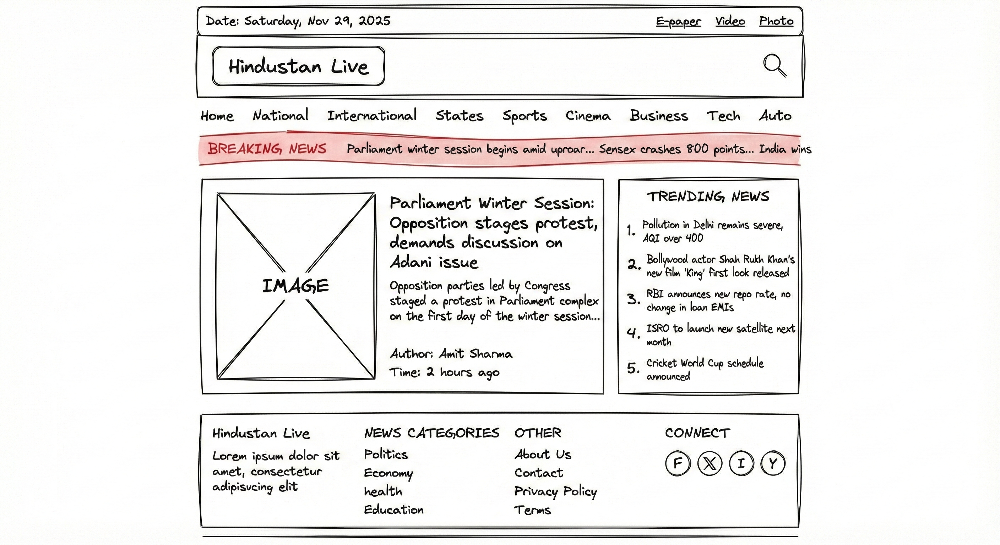
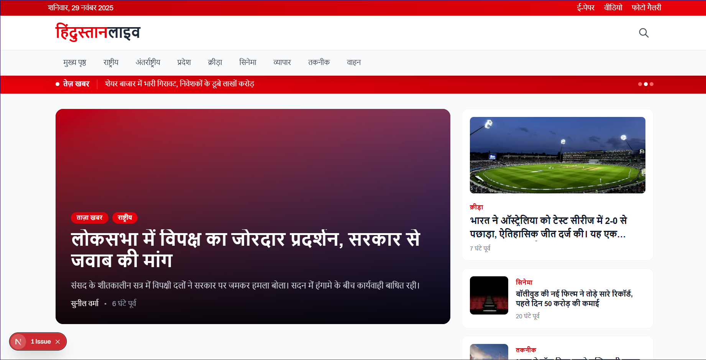

# Project Documentation

🔗 **Live Demo:** [fantastic-bavarois-b05c5c.netlify.app](https://fantastic-bavarois-b05c5c.netlify.app)

---

## Part A: Requirements Implementation

### 1. Layout & Structure

The portal follows a professional news website layout:

- **Header (Navbar.tsx)**
  - Top strip with date and quick links (ई-पेपर, वीडियो)
  - Logo section with brand name "हिंदुस्तान लाइव"
  - Expandable search bar
  - Navigation menu with all sections

- **Main Content**
  - Featured story hero section with gradient overlay
  - Two-column layout (main content + sidebar)
  - Section-based news organization
  - Breaking news ticker at top

- **Footer (SiteFooter.tsx)**
  - Section links organized in columns
  - Social media icons
  - Newsletter subscription form
  - Copyright and legal links

### 2. Data Fetching Strategy

**Incremental Static Regeneration (ISR)** is used throughout:

```typescript
// Homepage revalidates every 2 minutes
export const revalidate = 120;

// News articles revalidate every 5 minutes  
export const revalidate = 300;

// Section pages revalidate every 2 minutes
export const revalidate = 120;
```

**Why ISR?**
- News content needs to be fresh but not real-time
- Static pages provide fast loading
- Revalidation keeps content updated without rebuilding
- Good balance between performance and freshness

### 3. Dynamic Routing

Two dynamic route patterns implemented:

1. **`/news/[slug]`** - Individual news articles
   - `generateStaticParams()` pre-renders all articles
   - `generateMetadata()` creates dynamic SEO tags
   - Related articles shown in sidebar

2. **`/section/[slug]`** - Category pages
   - Pre-rendered for all 8 sections
   - Grid layout showing all articles in category
   - Custom 404 for invalid sections

### 4. Image Handling

Using Next.js `<Image>` component with:

```typescript
// next.config.ts
images: {
  remotePatterns: [
    {
      protocol: 'https',
      hostname: 'images.unsplash.com',
      pathname: '/**',
    },
  ],
}
```

Features:
- Automatic WebP conversion
- Lazy loading
- Responsive sizes attribute
- Fallback placeholder for missing images

### 5. Responsive Design

Mobile-first approach with Tailwind breakpoints:

- **Mobile (< 640px)**: Single column, hamburger menu
- **Tablet (640px - 1024px)**: 2-column grid
- **Desktop (> 1024px)**: 3-4 column grid, full navigation

Key responsive patterns:
```css
grid-cols-1 sm:grid-cols-2 lg:grid-cols-3 xl:grid-cols-4
hidden lg:flex  /* Desktop only */
lg:hidden       /* Mobile only */
```

### 6. SEO Implementation

Each page includes:

- **Meta tags** via `generateMetadata()`
- **OpenGraph** for social sharing
- **Twitter Cards** for Twitter previews
- **JSON-LD** structured data for news articles
- **Semantic HTML** (article, header, nav, aside)
- **Hindi language** declaration (`lang="hi"`)

---

## Part B: Design Decisions

### Color Scheme

| Element | Color | Reason |
|---------|-------|---------|
| Primary | Red-600 | Brand identity, matches LiveHindustan |
| Accent | Red-700 | Urgency (breaking news) |
| Background | Gray-50 | Easy on eyes |
| Text | Gray-900 | High contrast |

### Component Architecture

- **Modular components** - Each component has single responsibility
- **Variant props** - ArticleCard has default/compact/featured variants
- **Composition** - Complex layouts built from simple parts
- **Barrel exports** - Clean imports via `@/components`

### Typography

- Hindi-optimized font stack
- Line-clamp for text truncation
- Proper line-height for readability
- Hierarchical heading sizes

---

## Part C: Edge Cases

### 1. Missing Images

```tsx
{article.imageUrl ? (
  <Image src={article.imageUrl} ... />
) : (
  <div className="bg-gradient-to-br from-red-100 to-red-200">
    <NewsIcon />
  </div>
)}
```

### 2. Long Headlines

First article in mockData has extra-long title to test:
- CSS `line-clamp-2` or `line-clamp-3` truncates
- Title attribute shows full text on hover

### 3. Empty Data

```tsx
{articles.length > 0 ? (
  <ArticleGrid articles={articles} />
) : (
  <EmptyState message="कोई समाचार नहीं" />
)}
```

### 4. Invalid Routes

Custom 404 pages for:
- `/news/[invalid-slug]` - "समाचार नहीं मिला"
- `/section/[invalid-slug]` - "श्रेणी नहीं मिली"

---

## Part D: AI Usage Reflection

### How AI Assisted Development

#### 1. Project Architecture & Scaffolding

**Prompt Example:**
> "Create a Hindi news portal clone of LiveHindustan using Next.js 15 App Router with TypeScript"

**AI Contribution:**
- Generated complete folder structure following Next.js 15 conventions
- Set up `app/` directory with proper routing (`[slug]` dynamic routes)
- Created TypeScript interfaces for type safety
- Configured build tools (PostCSS, Tailwind, ESLint)

**What I Learned:**
The AI helped me understand the difference between `pages/` router (older) and `app/` router (newer). It also explained why async `params` is needed in Next.js 15.

#### 2. Component Development

**Prompt Example:**
> "Create an ArticleCard component with default and compact variants, supporting Hindi text"

**AI Contribution:**
- Generated responsive React components with Tailwind CSS
- Implemented variant patterns using TypeScript union types
- Applied proper Hindi typography considerations (line-height, font-family)

**Code Example Generated:**
```tsx
interface ArticleCardProps {
  article: NewsArticle;
  variant?: 'default' | 'compact' | 'featured';
}
```

**What I Learned:**
AI taught me about variant patterns in component design and how to use TypeScript discriminated unions for props.

#### 3. Hindi Content Generation

**Prompt Example:**
> "Generate 12 realistic Hindi news articles across different categories"

**AI Contribution:**
- Created authentic Hindi news content with proper grammar
- Maintained consistent tone matching real news portals
- Generated diverse topics (politics, sports, tech, entertainment)

**What I Verified:**
I manually reviewed the Hindi content to ensure it was grammatically correct and culturally appropriate.

#### 4. SEO & Metadata Implementation

**Prompt Example:**
> "Add SEO optimization with OpenGraph, Twitter Cards, and JSON-LD for news articles"

**AI Contribution:**
```tsx
// AI generated this structured data pattern
const jsonLd = {
  '@context': 'https://schema.org',
  '@type': 'NewsArticle',
  headline: article.headline,
  author: { '@type': 'Person', name: article.writer },
  datePublished: article.datePublished,
};
```

**What I Learned:**
Understanding of Schema.org vocabulary for news articles and how search engines interpret structured data.

#### 5. ISR (Incremental Static Regeneration) Setup

**Prompt Example:**
> "Implement ISR with 2-minute revalidation for homepage and 5-minute for articles"

**AI Contribution:**
```tsx
// Generated revalidation config
export const revalidate = 120; // Homepage - 2 minutes
export const revalidate = 300; // Articles - 5 minutes
```

**What I Learned:**
Trade-offs between freshness and build performance. ISR allows static benefits with dynamic content updates.

### Prompts Used (Detailed Log)

| Prompt | Purpose | Result |
|--------|---------|--------|
| "Create Next.js 15 Hindi news portal" | Initial setup | Full project structure |
| "Add ISR with 2-minute revalidation" | Caching strategy | `revalidate` export |
| "Handle missing images with placeholder" | Edge case | Gradient fallback |
| "Make responsive mobile-first" | Responsive design | Tailwind breakpoints |
| "Add search functionality" | Feature | Client-side filter |
| "Create Jest unit tests" | Testing | 25+ test cases |
| "Match LiveHindustan red theme" | Branding | Color scheme update |

### AI Assistance Boundaries

**What AI Did Well:**
- ✅ Boilerplate code generation
- ✅ Consistent coding patterns
- ✅ Hindi content creation
- ✅ Accessibility considerations
- ✅ SEO best practices

**What Required Human Judgment:**
- ⚠️ Design decisions (why red vs blue theme)
- ⚠️ Content accuracy verification
- ⚠️ UX flow decisions
- ⚠️ Performance optimization priorities
- ⚠️ Edge case identification

### Learning Outcomes

1. **Next.js 15 Patterns** - Async params, App Router, generateStaticParams
2. **TypeScript Best Practices** - Interfaces, type guards, discriminated unions
3. **Tailwind Responsive Design** - Mobile-first approach, breakpoint utilities
4. **SEO for News Sites** - Structured data, meta tags, semantic HTML
5. **Testing React Components** - Jest, React Testing Library, mocking

### Improvements Made with AI Assistance

| Feature | Before | After |
|---------|--------|-------|
| Search | None | Real-time client search |
| Error Handling | Browser default | Custom 404 pages |
| Accessibility | Basic | ARIA labels, semantic HTML |
| Images | No fallback | Gradient placeholder |
| Theme | Blue | Red (matching original site) |

---

## Wireframe & Preview

### Wireframe



### Preview Screenshot




---

## Preview Screenshot


